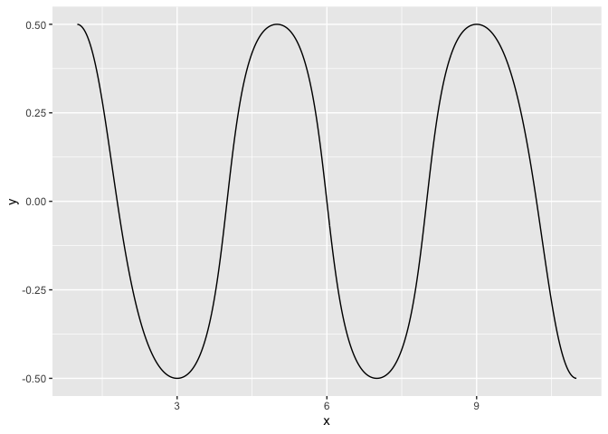
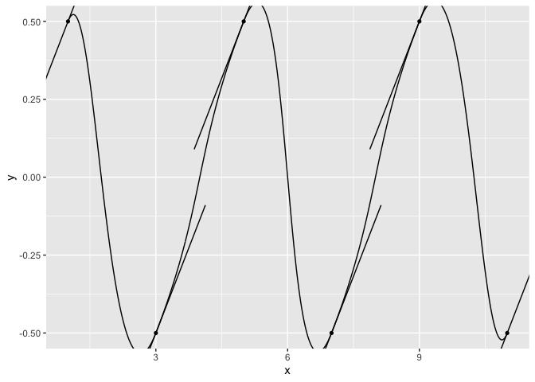
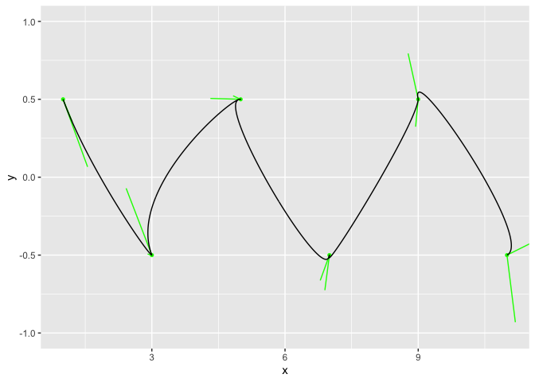
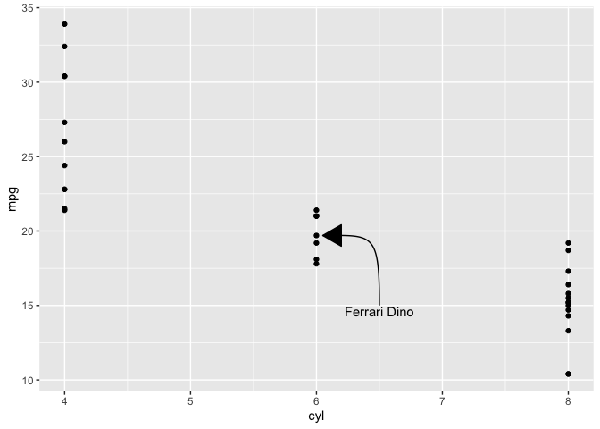

<!-- README.md is generated from README.Rmd. Please edit that file -->

# ggbezier

<!-- badges: start -->
<!-- badges: end -->

`ggbezier` makes it easy to work with [Bezier
curves](https://en.wikipedia.org/wiki/B%C3%A9zier_curve) in \`ggplot2.

## Installation

You can install the development version of ggbezier from Github:

``` r
devtools::install_github("const-ae/ggbezier")
```

## Example

This is a basic example which shows you how to solve a common problem:

``` r
library(ggplot2)
library(ggbezier)

# Only recommended, but not required
library(dplyr)
#> 
#> Attaching package: 'dplyr'
#> The following objects are masked from 'package:stats':
#> 
#>     filter, lag
#> The following objects are masked from 'package:base':
#> 
#>     intersect, setdiff, setequal, union
```

Bezier curves are useful for drawing wavy things.

``` r
wave_data <- data.frame(
  x = seq(1, 12, by = 2),
  y = rep(c(0.5, -0.5), times = 3)
)

ggplot(wave_data, aes(x = x, y = y)) +
    geom_bezier()
```



The shape is controlled by *control points* of handles. Set
`draw_handles = TRUE` to see them.

``` r
ggplot(wave_data, aes(x = x, y = y)) +
    geom_bezier(show_handles = TRUE)
```


You can change the handles by setting

- their `angle` and `handle_length`, or
- the position of the next end point (`x_handle` and `y_handle`), or
- the position of the left and right handle (`x_handle1`, `y_handle1`,
  `x_handle2`, and `y_handle2`).

``` r
ggplot(wave_data, aes(x = x, y = y)) +
    geom_bezier(show_handles = TRUE, angle = 20)
```



Data with randomized handle positions:

``` r
wave_data %>%
  mutate(x_handle1 = x + rnorm(n(), sd = 0.4),
         x_handle2 = x + rnorm(n(), sd = 0.4),
         y_handle1 = y + rnorm(n(), sd = 0.4),
         y_handle2 = y + rnorm(n(), sd = 0.4)) %>%
  ggplot(aes(x = x, y = y, x_handle1 = x_handle1, x_handle2 = x_handle2, y_handle1 = y_handle1, y_handle2 = y_handle2)) +
    geom_bezier(show_handles = TRUE, show_curve = FALSE, color = "green") +
    geom_bezier(show_handles = FALSE, show_curve = TRUE, color = "black") +
    lims(y = c(-1, 1))
```



Bezier curves are also useful for drawing pretty arrows and annotating
datapoints:

``` r
ggplot(mtcars, aes(x = cyl, y = mpg)) +
    geom_point() +
    geom_bezier(data = data.frame(x = c(6.05, 6.5), y = c(19.7, 15), angle = c(0, -90), handle_length = c(0.4, 5)),
                aes(x = x, y = y, angle = angle, handle_length = handle_length),
                arrow = arrow(type = "closed", ends = "first")) +
    annotate("text", x = 6.5, y = 15, hjust = 0.5, vjust = 1.1, label = "Ferrari Dino")
```



``` r
sessionInfo()
#> R version 4.4.1 (2024-06-14)
#> Platform: x86_64-apple-darwin20
#> Running under: macOS Sonoma 14.6.1
#> 
#> Matrix products: default
#> BLAS:   /Library/Frameworks/R.framework/Versions/4.4-x86_64/Resources/lib/libRblas.0.dylib 
#> LAPACK: /Library/Frameworks/R.framework/Versions/4.4-x86_64/Resources/lib/libRlapack.dylib;  LAPACK version 3.12.0
#> 
#> locale:
#> [1] en_US.UTF-8/en_US.UTF-8/en_US.UTF-8/C/en_US.UTF-8/en_US.UTF-8
#> 
#> time zone: Europe/Berlin
#> tzcode source: internal
#> 
#> attached base packages:
#> [1] stats     graphics  grDevices utils     datasets  methods   base     
#> 
#> other attached packages:
#> [1] dplyr_1.1.4    ggbezier_0.1.0 ggplot2_3.5.1 
#> 
#> loaded via a namespace (and not attached):
#>  [1] vctrs_0.6.5       cli_3.6.2         knitr_1.47        rlang_1.1.4      
#>  [5] xfun_0.45         highr_0.11        generics_0.1.3    labeling_0.4.3   
#>  [9] glue_1.7.0        colorspace_2.1-0  htmltools_0.5.8.1 scales_1.3.0     
#> [13] fansi_1.0.6       rmarkdown_2.27    grid_4.4.1        evaluate_0.24.0  
#> [17] munsell_0.5.1     tibble_3.2.1      fastmap_1.2.0     yaml_2.3.8       
#> [21] lifecycle_1.0.4   compiler_4.4.1    pkgconfig_2.0.3   rstudioapi_0.16.0
#> [25] farver_2.1.2      digest_0.6.35     R6_2.5.1          tidyselect_1.2.1 
#> [29] utf8_1.2.4        pillar_1.9.0      magrittr_2.0.3    withr_3.0.0      
#> [33] tools_4.4.1       gtable_0.3.5
```
